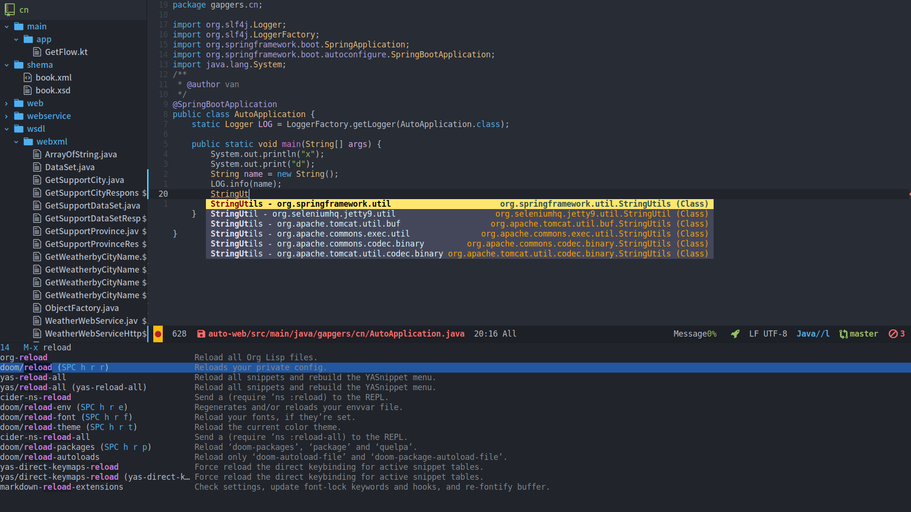

# PLUGINS & FEATURES

1.  lsp-java
2.  ejc-sql
3.  evil-fcitx
4.  insert-translated-name
5.  plantuml uml
6.  number-region
7.  counsel-fzf-dir-function
8.  custom-set-faces
9.  some shortcuts

# INSTALL EMACS

Choose your operation system and install it.

<https://www.gnu.org/software/emacs/>

# CLONE DOOM

    clone https://github.com/hlissner/doom-emacs.git ~/.emacs.doom/

# CLONE REPOSITORY

    git clone https://github.com/vanniuner/emacs-doom-private.git ~/.doom.d/

# DOOM INSTALL

Make sure that you have some setting in your terminal environment.

Set up a vpn if you need it.

    export http_proxy="ip:port"
    export https_proxy="ip:port"

Set your emacs cmd for doom install.

    export EMACS=/bin/emacs26

At last run below, this will take few minutes. And it depends on the quality of your network.

    ~/.emacs.doom/bin/doom install

